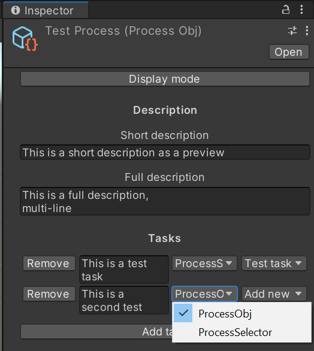

# Workflow

_This tool is a Unity editor tool._

Workflow is a tool to help you manage processes, folders and features development.

## Usage

In the Unity Editor, in the top menu bar, under the "Tools" tab you'll find the "Workflow" option with 3 sub-options.

- **Generate folder structure** : This will generate default folders for the most common asset types.\

- **New feature environment** : This will generate a test folder for the provided feature name.
- **Migration window** : This will migrate the selected feature in the general folders.\

- **Process Database** : This will open a window where all the ProcessObj will be displayed and reachable as well as fields to change the marker used to detect tasks and the path for new process creation.\

### Process

Each process is described in a **ScriptableObject** called `ProcessObj`.\
You can access those objects through the project window or through the **Process Database**.\
These processes have a display mode and an edit mode.

Clicking a checkbox next to a task will mark it as complete.

Clicking a task text will open the code editor to the selected line.\
Lines get detected using the "Code marker" present in code comments.

Clicking the "Edit mode" button will switch the process into edit mode where you can change the short description (for process database), full description (for process) and the task list.

You can link a task to a comment line containing the "Code marker".\
For this, you can select a script file and a line in the popups next to a task.

